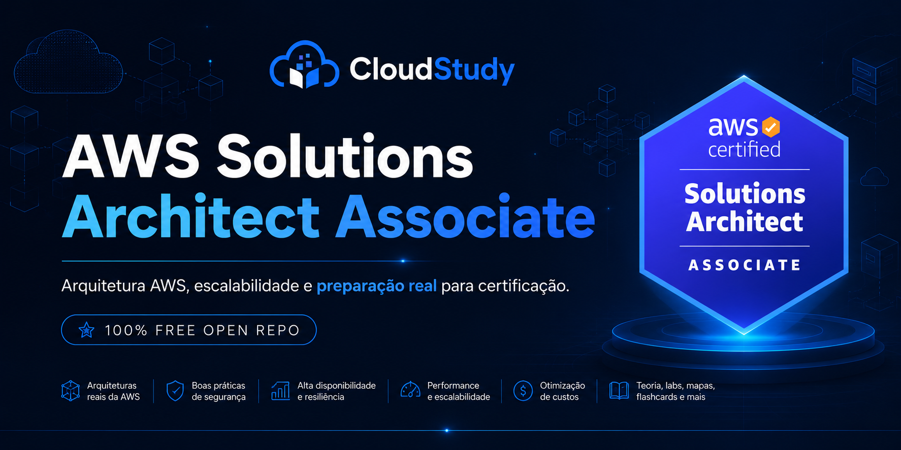
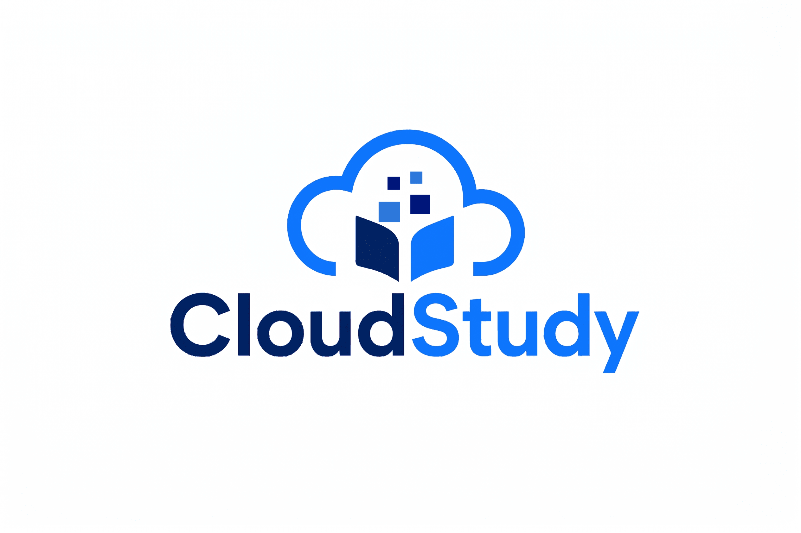

  

  

  <strong> Estude para a AWS Solutions Architect Associate (SAA-C03) com teoria, labs, flashcards, cheatsheets e simulados.</strong>

  <strong> Entre na lista de espera da CloudStudy e receba acesso antecipado à plataforma.</strong>

  

  

## Patrocínio educacional

  Este projeto conta com apoio da
  <a href="https://www.cloudstudy.com.br">CloudStudy</a>.

  

 

<h1 align="center">AWS Solutions Architect Associate (SAA-C03)</h1>

  
  
  

  
  
  
  
  

  <a href="#como-usar-este-repositorio">Como usar</a> •
  <a href="#fluxo-recomendado-de-estudo">Fluxo de estudo</a> •
  <a href="#roteiro-de-estudo">Roteiro</a> •
  <a href="#modulos">Módulos</a> •
  <a href="./29-Simulados-e-Questoes/README.md">Simulados</a> •
  <a href="#trilhas-complementares-aws">Trilhas AWS</a>

Material aberto por Thiago Cardoso • <a href="https://www.linkedin.com/in/analyticsthiagocardoso">LinkedIn</a>

---

## O que você vai encontrar neste repositório

| Tema | O que você encontra aqui |
|---|---|
| Arquiteturas reais da AWS | Cenários de prova, trade-offs e decisões arquiteturais com foco prático. |
| Alta disponibilidade e resiliência | Multi-AZ, failover, desacoplamento, continuidade e estratégias de DR. |
| Segurança e IAM | IAM, KMS, criptografia, políticas, auditoria e governança aplicada. |
| Redes e VPC | Subnets, roteamento, endpoints, conectividade híbrida e segurança de rede. |
| Banco de dados e armazenamento | RDS, Aurora, DynamoDB, S3, EBS, EFS e escolhas por desempenho e custo. |
| Serverless e containers | Lambda, API Gateway, ECS, EKS, Fargate e padrões modernos de execução. |
| Otimização de custos | Rightsizing, storage classes, automação e decisões custo-eficientes. |
| Simulados comentados | Questões no estilo SAA-C03, revisão de alternativas e caderno de erros. |
| Labs, mapas e flashcards | Labs guiados, roteiros por semana, cheatsheets e revisão espaçada. |

## 🚦 Por onde começar

- **Trilha para iniciantes (do zero):** siga [Módulo 01](./01-Introducao-SAA-C03/README.md) → [Módulo 02](./02-IAM-e-Seguranca/README.md) → [Módulo 04](./04-Computacao-EC2/README.md) → [Módulo 05](./05-Alta-Disponibilidade-e-Escalabilidade/README.md) → [Módulo 06](./06-Amazon-S3-e-Armazenamento/README.md) → [Módulo 08](./08-VPC-e-Redes/README.md) → [Módulo 10](./10-Banco-de-Dados/README.md) e complete na ordem até [Módulo 31](./31-Recursos-e-Links/README.md), incluindo os labs correspondentes em cada semana.
- **Revisão rápida:** faça revisão por [cheatsheets](./01-Introducao-SAA-C03/cheatsheet.md), [flashcards](./01-Introducao-SAA-C03/flashcards.md) e [questões](./29-Simulados-e-Questoes/README.md), priorizando módulos com maior peso no exame (segurança, resiliência, performance e custo).
- **Reta final / últimos 14 dias:** concentre em [05](./05-Alta-Disponibilidade-e-Escalabilidade/README.md), [06](./06-Amazon-S3-e-Armazenamento/README.md), [08](./08-VPC-e-Redes/README.md), [10](./10-Banco-de-Dados/README.md), [13](./13-DNS-Route53-e-CloudFront/README.md), [14](./14-Desacoplamento-SQS-SNS-EventBridge/README.md), [17](./17-Serverless-Lambda-API-Gateway/README.md), [22](./22-Recuperacao-de-Desastres-e-Continuidade/README.md), [26](./26-Well-Architected-Framework/README.md) e finalize com o hub do [Módulo 29](./29-Simulados-e-Questoes/README.md): mini-simulados, caderno de erros e plano de reta final.

> Trilha aberta em Português do Brasil para revisão estruturada do exame AWS Certified Solutions Architect Associate SAA-C03.

Repositório oficial: https://github.com/Thiago-code-lab/aws-certified-solutions-architect-associate-brasil

## 🎯 Sobre este Repositório

Este repositório combina material open-source em Português do Brasil com foco em raciocínio arquitetural real: trade-offs, casos de uso, armadilhas de prova, labs curados para baixo custo e questões práticas no estilo do exame SAA-C03.

Este material foi estruturado para um estudante de nível intermediário, que já usa AWS no dia a dia e já domina os fundamentos de cloud. O foco não é memorização cega: o objetivo é desenvolver o raciocínio esperado de um arquiteto de soluções, entendendo trade-offs entre resiliência, desempenho, segurança e custo.

O repositório foi pensado para funcionar bem no GitHub. Cada módulo contém teoria, questões no estilo da prova, flashcards, cheatsheet, cenários arquiteturais, labs e curadoria de links oficiais. A ordem dos módulos acompanha os temas mais cobrados no exame e uma progressão de complexidade que faz sentido para revisão em 9 semanas.

## 📊 Estrutura e Domínios do Exame

| Domínio | Peso | O que cai na prática | Módulos principais |
|---|---:|---|---|
| Arquiteturas resilientes (Design Resilient Architectures) | 30% | Alta disponibilidade, recuperação de desastres, desacoplamento, multi-AZ e multi-region | 05, 06, 08, 09, 13, 14, 21, 22, 24, 26 |
| Arquiteturas de alta performance (Design High-Performing Architectures) | 28% | Seleção de compute, cache, performance de storage, redes e bancos | 04, 06, 08, 10, 11, 12, 13, 16, 18 |
| Aplicações e arquiteturas seguras (Design Secure Applications and Architectures) | 24% | IAM, KMS, isolamento de rede, criptografia, trilhas de auditoria e governança | 02, 03, 08, 09, 14, 17, 20, 23, 24, 25 |
| Arquiteturas otimizadas em custo (Design Cost-Optimized Architectures) | 18% | Rightsizing, classes de storage, modelos de compra, serverless e automação | 04, 06, 15, 17, 21, 23 |

## 🗺️ Mapa de Estudos

### Semana 1
- Módulo 01: visão do exame, estratégia, pesos e serviços mais cobrados
- Módulo 02: IAM, KMS, Organizations, Identity Center e políticas
- Módulo 03: laboratório guiado de IAM e segurança

### Semana 2
- Módulo 04: EC2, EBS, placement groups e modelos de compra
- Módulo 05: ELB, ASG, health checks e escalabilidade

### Semana 3
- Módulo 06: S3, lifecycle, replicação, classes e segurança
- Módulo 07: laboratório avançado de S3
- Módulo 08: VPC, subnets, endpoints, rotas e segurança de rede
- Módulo 09: laboratório de VPC e redes

### Semana 4
- Módulo 10: bancos de dados para arquitetura (RDS, Aurora, DynamoDB, ElastiCache, Redshift)
- Módulo 11: laboratório de RDS e bancos relacionais
- Módulo 12: modelagem e padrões com DynamoDB
- Módulo 13: Route 53, CloudFront, OAC, WAF e Global Accelerator

### Semana 5
- Módulo 14: SQS, SNS, EventBridge e Step Functions
- Módulo 15: laboratório de mensageria SQS/SNS
- Módulo 16: ECS, EKS, Fargate, ECR e App Runner

### Semana 6
- Módulo 17: Lambda, API Gateway, authorizers e observabilidade serverless
- Módulo 18: Kinesis, Firehose, Glue, Athena, EMR e analytics

### Semana 7
- Módulo 19: serviços gerenciados de IA e ML mais cobrados
- Módulo 20: CloudWatch, CloudTrail, Config e X-Ray
- Módulo 21: DMS, MGN, DataSync, Snow Family e Transfer Family

### Semana 8
- Módulo 22: recuperação de desastres, continuidade, RTO/RPO e estratégias DR
- Módulo 23: AWS Organizations, governança multi-conta e otimização de custos
- Módulo 24: redes avançadas e conectividade híbrida (TGW, DX, VPN, PrivateLink)
- Módulo 25: criptografia com KMS e gestão de segredos com Secrets Manager/SSM

### Semana 9
- Módulo 26: Well-Architected Framework e DR patterns
- Módulo 27: estudos de caso reais
- Módulo 28: labs end-to-end
- Módulo 29: simulados e revisões
- Módulo 30 e 31: glossário e revisão de links oficiais

## 📁 Módulos

| # | Módulo | Domínio predominante | Status | Link |
|---|---|---|---|---|
| 01 | Introdução SAA-C03 | Base / Estratégia | Aberto | [README](./01-Introducao-SAA-C03/README.md) |
| 02 | IAM e Segurança | Segurança | Aberto | [README](./02-IAM-e-Seguranca/README.md) |
| 03 | IAM e Segurança (Labs) | Segurança (prática) | Aberto | [Lab](./03-IAM-e-Seguranca-Labs/lab.md) |
| 04 | Computação EC2 | Alta performance | Aberto | [README](./04-Computacao-EC2/README.md) |
| 05 | Alta Disponibilidade e Escalabilidade | Resiliência | Aberto | [README](./05-Alta-Disponibilidade-e-Escalabilidade/README.md) |
| 06 | Amazon S3 e Armazenamento | Resiliência / Custo | Aberto | [README](./06-Amazon-S3-e-Armazenamento/README.md) |
| 07 | S3 Avançado (Labs) | Resiliência (prática) | Aberto | [Lab](./07-S3-Avancado-Labs/lab.md) |
| 08 | VPC e Redes | Segurança / Resiliência | Aberto | [README](./08-VPC-e-Redes/README.md) |
| 09 | VPC e Redes (Labs) | Segurança (prática) | Aberto | [Lab](./09-VPC-e-Redes-Labs/lab.md) |
| 10 | Banco de Dados | Alta performance | Aberto | [README](./10-Banco-de-Dados/README.md) |
| 11 | RDS e Bancos Relacionais (Labs) | Alta performance (prática) | Aberto | [Lab](./11-RDS-e-Bancos-Relacionais-Labs/lab.md) |
| 12 | DynamoDB (Labs) | Alta performance (prática) | Aberto | [Lab](./12-DynamoDB/lab.md) |
| 13 | DNS, Route 53 e CloudFront | Resiliência / Performance | Aberto | [README](./13-DNS-Route53-e-CloudFront/README.md) |
| 14 | Desacoplamento: SQS, SNS, EventBridge | Resiliência | Aberto | [README](./14-Desacoplamento-SQS-SNS-EventBridge/README.md) |
| 15 | SQS e SNS (Labs) | Resiliência (prática) | Aberto | [Lab](./15-SQS-SNS-Mensageria-Labs/lab.md) |
| 16 | Containers: ECS, EKS, Fargate | Alta performance | Aberto | [README](./16-Containers-ECS-EKS-Fargate/README.md) |
| 17 | Serverless: Lambda e API Gateway | Custo / Segurança | Aberto | [README](./17-Serverless-Lambda-API-Gateway/README.md) |
| 18 | Dados e Analytics | Alta performance | Aberto | [README](./18-Dados-e-Analytics/README.md) |
| 19 | Machine Learning e IA | Serviços gerenciados | Aberto | [README](./19-Machine-Learning-e-IA/README.md) |
| 20 | Monitoramento: CloudWatch e CloudTrail | Segurança / Operações | Aberto | [README](./20-Monitoramento-CloudWatch-CloudTrail/README.md) |
| 21 | Migração e Transferência | Resiliência / Custo | Aberto | [README](./21-Migracao-e-Transferencia/README.md) |
| 22 | Recuperação de Desastres e Continuidade | Resiliência / Segurança | Aberto | [README](./22-Recuperacao-de-Desastres-e-Continuidade/README.md) |
| 23 | AWS Organizations, Governança e Custos | Segurança / Custo | Aberto | [README](./23-AWS-Organizations-Governanca-e-Custos/README.md) |
| 24 | Redes Avançadas e Conectividade Híbrida | Segurança / Performance | Aberto | [README](./24-Redes-Avancadas-e-Conectividade-Hibrida/README.md) |
| 25 | Criptografia, KMS e Gestão de Segredos | Segurança | Aberto | [README](./25-Criptografia-KMS-e-Gestao-de-Segredos/README.md) |
| 26 | Well-Architected Framework | Todos os domínios | Aberto | [README](./26-Well-Architected-Framework/README.md) |
| 27 | Casos de Uso Reais | Todos os domínios | Aberto | [README](./27-Casos-de-Uso-Reais/README.md) |
| 28 | Labs Práticos | Prática | Aberto | [README](./28-Labs-Praticos/README.md) |
| 29 | Simulados, Questões e Reta Final | Todos os domínios | Aberto | [README](./29-Simulados-e-Questoes/README.md) |
| 30 | Glossário | Revisão | Aberto | [README](./30-Glossario/README.md) |
| 31 | Recursos e Links | Revisão | Aberto | [README](./31-Recursos-e-Links/README.md) |

## 🧩 Visão geral dos módulos

| Nome do módulo | Semana / posição | Teoria (Sim/Não) | Lab (Sim/Não) | Cheatsheet (Sim/Não) | Questões práticas (Sim/Não) |
|---|---|---|---|---|---|
| [01 - Introdução SAA-C03](./01-Introducao-SAA-C03/README.md) | Semana 1 | Sim | Sim | Sim | Sim |
| [02 - IAM e Segurança](./02-IAM-e-Seguranca/README.md) | Semana 1 | Sim | Sim | Sim | Sim |
| [03 - IAM e Segurança (Labs)](./03-IAM-e-Seguranca-Labs/lab.md) | Semana 1 | Não | Sim | Não | Não |
| [04 - Computação EC2](./04-Computacao-EC2/README.md) | Semana 2 | Sim | Sim | Sim | Sim |
| [05 - Alta Disponibilidade e Escalabilidade](./05-Alta-Disponibilidade-e-Escalabilidade/README.md) | Semana 2 | Sim | Sim | Sim | Sim |
| [06 - Amazon S3 e Armazenamento](./06-Amazon-S3-e-Armazenamento/README.md) | Semana 3 | Sim | Não | Sim | Sim |
| [07 - S3 Avançado (Labs)](./07-S3-Avancado-Labs/lab.md) | Semana 3 | Não | Sim | Não | Não |
| [08 - VPC e Redes](./08-VPC-e-Redes/README.md) | Semana 3 | Sim | Não | Sim | Sim |
| [09 - VPC e Redes (Labs)](./09-VPC-e-Redes-Labs/lab.md) | Semana 3 | Não | Sim | Não | Não |
| [10 - Banco de Dados](./10-Banco-de-Dados/README.md) | Semana 4 | Sim | Não | Sim | Sim |
| [11 - RDS e Bancos Relacionais (Labs)](./11-RDS-e-Bancos-Relacionais-Labs/lab.md) | Semana 4 | Não | Sim | Não | Não |
| [12 - DynamoDB (Labs)](./12-DynamoDB/lab.md) | Semana 4 | Não | Sim | Não | Não |
| [13 - DNS, Route 53 e CloudFront](./13-DNS-Route53-e-CloudFront/README.md) | Semana 4 | Sim | Não | Sim | Sim |
| [14 - Desacoplamento: SQS, SNS, EventBridge](./14-Desacoplamento-SQS-SNS-EventBridge/README.md) | Semana 5 | Sim | Não | Sim | Sim |
| [15 - SQS e SNS (Labs)](./15-SQS-SNS-Mensageria-Labs/lab.md) | Semana 5 | Não | Sim | Não | Não |
| [16 - Containers: ECS, EKS, Fargate](./16-Containers-ECS-EKS-Fargate/README.md) | Semana 5 | Sim | Não | Sim | Sim |
| [17 - Serverless: Lambda e API Gateway](./17-Serverless-Lambda-API-Gateway/README.md) | Semana 6 | Sim | Sim | Sim | Sim |
| [18 - Dados e Analytics](./18-Dados-e-Analytics/README.md) | Semana 6 | Sim | Sim | Sim | Sim |
| [19 - Machine Learning e IA](./19-Machine-Learning-e-IA/README.md) | Semana 7 | Sim | Sim | Sim | Sim |
| [20 - Monitoramento: CloudWatch e CloudTrail](./20-Monitoramento-CloudWatch-CloudTrail/README.md) | Semana 7 | Sim | Sim | Sim | Sim |
| [21 - Migração e Transferência](./21-Migracao-e-Transferencia/README.md) | Semana 7 | Sim | Sim | Sim | Sim |
| [22 - Recuperação de Desastres e Continuidade](./22-Recuperacao-de-Desastres-e-Continuidade/README.md) | Semana 8 | Sim | Sim | Sim | Sim |
| [23 - AWS Organizations, Governança e Custos](./23-AWS-Organizations-Governanca-e-Custos/README.md) | Semana 8 | Sim | Sim | Sim | Sim |
| [24 - Redes Avançadas e Conectividade Híbrida](./24-Redes-Avancadas-e-Conectividade-Hibrida/README.md) | Semana 8 | Sim | Sim | Sim | Sim |
| [25 - Criptografia, KMS e Gestão de Segredos](./25-Criptografia-KMS-e-Gestao-de-Segredos/README.md) | Semana 8 | Sim | Sim | Sim | Sim |
| [26 - Well-Architected Framework](./26-Well-Architected-Framework/README.md) | Semana 9 | Sim | Sim | Sim | Sim |
| [27 - Casos de Uso Reais](./27-Casos-de-Uso-Reais/README.md) | Semana 9 | Sim | Sim | Sim | Sim |
| [28 - Labs Práticos](./28-Labs-Praticos/README.md) | Semana 9 | Sim | Sim | Sim | Sim |
| [29 - Simulados, Questões e Reta Final](./29-Simulados-e-Questoes/README.md) | Semana 9 | Sim | Sim | Sim | Sim |
| [30 - Glossário](./30-Glossario/README.md) | Semana 9 | Sim | Sim | Sim | Sim |
| [31 - Recursos e Links](./31-Recursos-e-Links/README.md) | Semana 9 | Sim | Sim | Sim | Sim |

## 🚀 Como Usar Este Repositório

1. Comece pelo módulo 01 para alinhar expectativa, pesos e estratégia.
2. Estude os módulos 02 a 25 em ordem e use os módulos de laboratório para consolidar os temas críticos.
3. Ao final de cada módulo, resolva as questões antes de abrir o gabarito.
4. Use os flashcards para revisão espaçada e o cheatsheet para revisão rápida pré-simulado.
5. Rode os labs em us-east-1 sempre que possível para manter consistência com o material.
6. Feche a preparação com estudos de caso, labs end-to-end, simulados, caderno de erros e revisão por domínio.

## 🔁 Fluxo Recomendado de Estudo

1. Leia o README do módulo para entender contexto, serviços e sinais de prova.
2. Revise o cheatsheet antes de resolver questões.
3. Resolva as questões sem abrir o bloco de resposta.
4. Registre erros recorrentes no [caderno de erros](./29-Simulados-e-Questoes/caderno-de-erros.md).
5. Reforce pontos fracos com flashcards e mini-simulados por domínio.

## ✅ Checklist Curto de Revisão Final

- Diferenciar Multi-AZ, Read Replica, backup, restore e estratégias de DR.
- Revisar IAM, KMS, Secrets Manager, políticas e menor privilégio.
- Comparar S3, EBS, EFS, FSx e classes de armazenamento.
- Treinar VPC, endpoints, NAT Gateway, security groups, NACLs e roteamento.
- Refazer questões erradas antes de iniciar novos simulados.

## 🧭 Trilhas Complementares AWS

- [AWS Certified Cloud Practitioner Brasil](https://github.com/Thiago-code-lab/aws-certified-cloud-practitioner-brasil): fundamentos para quem precisa reforçar base de cloud antes do SAA-C03.
- [AWS Certified AI Practitioner Brasil](https://github.com/Thiago-code-lab/aws-certified-ai-practitioner-brasil): trilha complementar para conectar arquitetura AWS com serviços de IA generativa.
- [CloudStudy](https://www.cloudstudy.com.br/): apoio complementar para estudo guiado e evolução contínua, sem substituir a proposta open-source deste repositório.

## ⚠️ Armadilhas comuns na prova

| Confusão frequente | Quando usar cada opção | Armadilha típica de prova |
|---|---|---|
| SNS vs SQS | SNS para fanout pub/sub; SQS para fila desacoplada com processamento assíncrono e controle de consumo. | Confundir broadcast para múltiplos consumidores com fila ponto a ponto. |
| SQS Standard vs FIFO | Standard para throughput alto e tolerância a duplicidade/ordem eventual; FIFO para ordem estrita e deduplicação. | Escolher FIFO sem necessidade e perder escala, ou escolher Standard quando a ordem é mandatória. |
| RDS Multi-AZ vs Read Replicas | Multi-AZ para alta disponibilidade e failover; Read Replicas para escalar leitura e relatórios. | Assumir que Multi-AZ melhora leitura ou que réplica substitui HA síncrona. |
| NAT Gateway vs VPC Endpoint | NAT Gateway para saída privada geral à internet; VPC Endpoint para acesso privado a serviços AWS sem internet. | Usar NAT para S3/DynamoDB e pagar mais, mesmo com endpoint disponível. |
| ALB vs NLB vs CLB | ALB para HTTP/HTTPS camada 7; NLB para TCP/UDP/TLS camada 4 e latência baixa; CLB para legado. | Ignorar requisito de protocolo e sticky/session routing. |
| S3 Standard vs IA vs One Zone-IA vs Glacier | Standard para acesso frequente; IA para acesso esporádico; One Zone-IA para dados reproduzíveis; Glacier para arquivamento. | Escolher classe barata sem considerar latência de recuperação e mínimo de retenção. |
| EBS vs EFS vs FSx | EBS para bloco em EC2; EFS para compartilhamento NFS multi-AZ Linux; FSx para file systems especializados (Windows, Lustre, ONTAP, OpenZFS). | Tratar EBS como compartilhado por múltiplas instâncias sem arquitetura específica. |
| ASG vs scheduled scaling vs predictive scaling | ASG para elasticidade automática por métricas; scheduled para eventos previsíveis; predictive para padrões históricos. | Usar apenas scheduled em carga imprevisível e perder resiliência em picos. |
| API Gateway vs ALB para Lambda | API Gateway para APIs gerenciadas com auth, throttling e versionamento; ALB para roteamento HTTP simples com integração Lambda. | Escolher ALB quando a questão pede recursos avançados de API management. |
| KMS CMK vs Secrets Manager vs SSM Parameter Store | KMS para criptografia/chaves; Secrets Manager para rotação e segredo sensível; Parameter Store para parâmetros e segredos simples. | Achar que KMS sozinho resolve ciclo de vida de segredos. |

## 🤝 Como contribuir

Consulte [CONTRIBUTING.md](./CONTRIBUTING.md) para abrir issues, propor labs/questões e enviar pull requests de forma padronizada e objetiva.

Contribuições são bem-vindas, especialmente para:

- corrigir detalhes técnicos e limites de serviço
- melhorar cenários de questões e explicações de alternativas
- atualizar mudanças recentes dos serviços AWS
- adicionar diagramas ASCII mais claros e labs mais econômicos

Ao contribuir, prefira mudanças pequenas, tecnicamente justificadas e com links oficiais da AWS quando o assunto envolver comportamento específico de serviço.

## 📦 Releases

Para atualizações relevantes de conteúdo, consulte a página de Releases no GitHub e o histórico em [CHANGELOG.md](./CHANGELOG.md).

## 📄 Licença

MIT

## ✅ Qualidade do conteúdo e última revisão

- O conteúdo é baseado em documentação oficial da AWS e whitepapers relevantes.
- Os exemplos e labs priorizam escolhas de baixo custo para estudo prático.
- O repositório é atualizado periodicamente conforme mudanças em serviços AWS e no blueprint do exame.

**Última revisão global:** 08/04/2026 (atualizar esta data sempre que concluírem uma revisão ampla do repositório).

